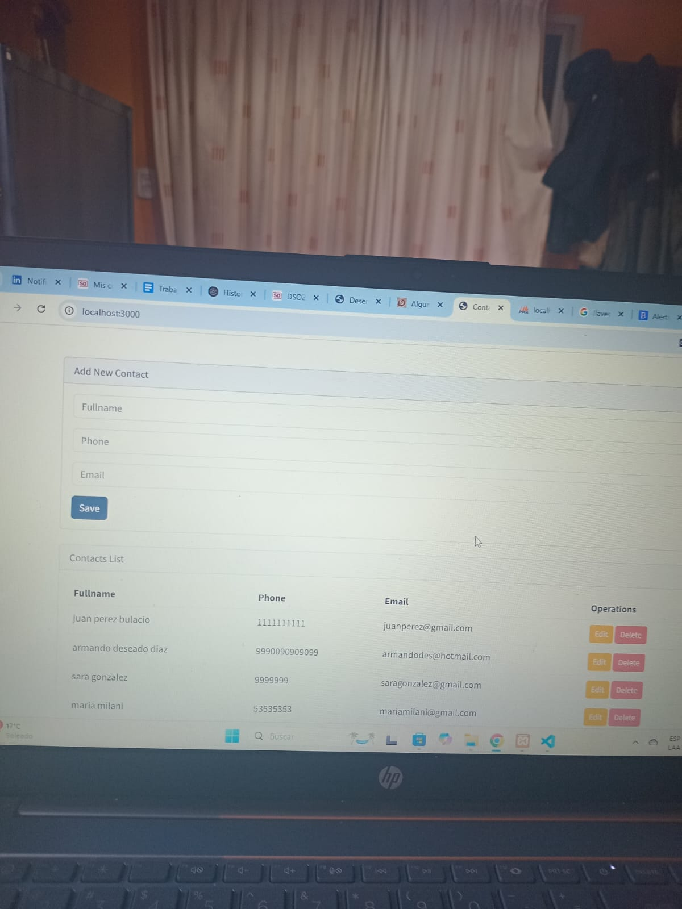
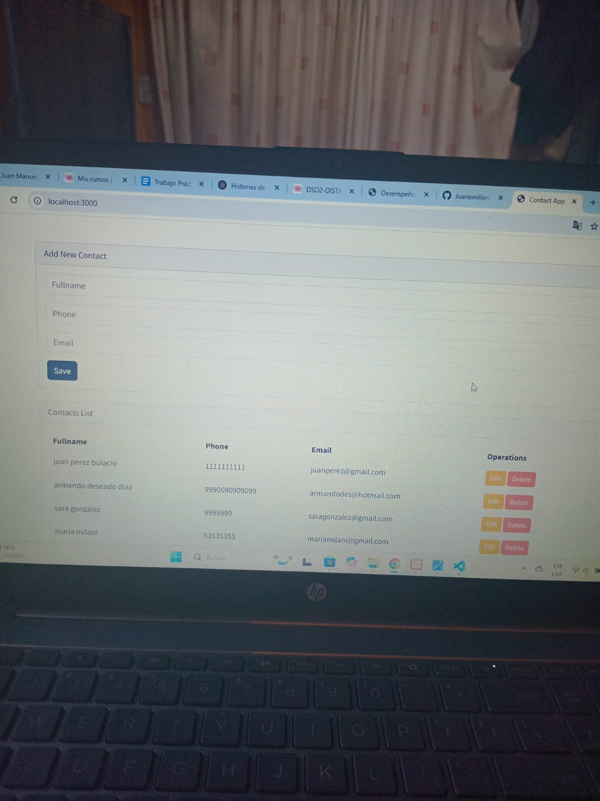
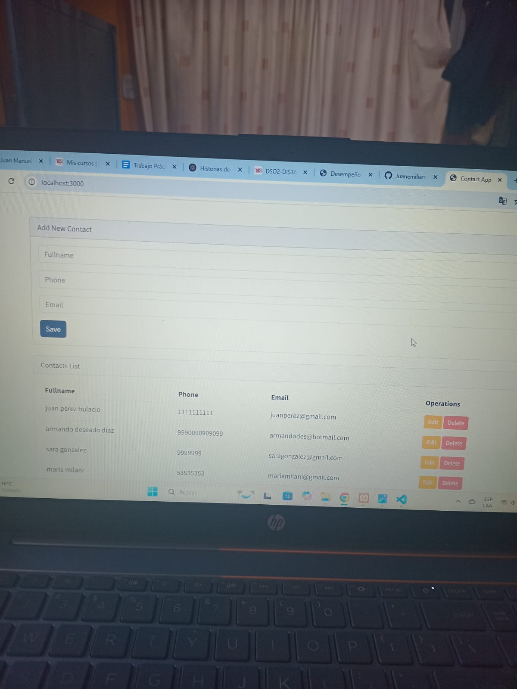
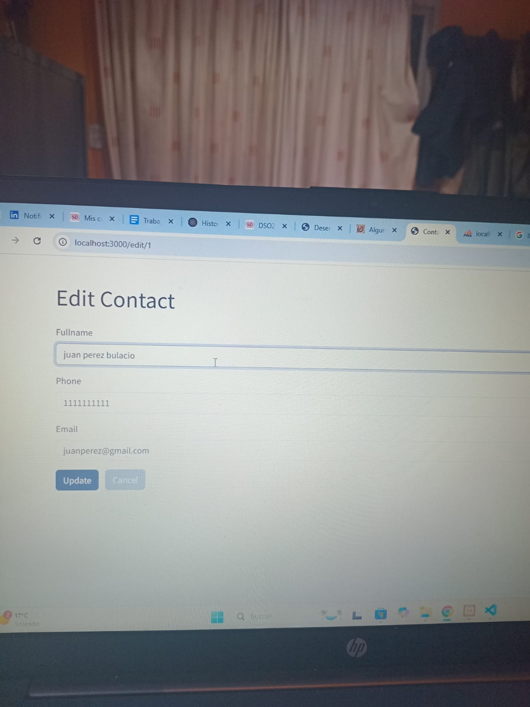

# Flask Contact App

A simple Flask web application to manage contacts with MySQL as database.

---

## Features

- Add new contacts (Fullname, Phone, Email)
- List all contacts
- Edit and update contacts
- Delete contacts
- Flash messages for feedback
- Bootstrap 5 UI with Bootswatch Flatly theme

---

##Screenshots:






---

## Installation & Setup

### Requirements

- Python 3.x
- MySQL Server installed and running
- pip (Python package manager)

### Steps

1. Clone this repository:

```bash
git clone https://github.com/Juanemiliani70/App_contacts.git
cd App_contacts

---## Setup Instructions

### 1. Create and Activate Your Virtual Environment (Optional but Recommended)

python -m venv venv
# On Linux/macOS
source venv/bin/activate
# On Windows
venv\Scripts\activate

---

## Install dependencies:
pip install -r requirements.txt
---

## Configure mysql database:

mysql -u root -p

CREATE DATABASE flaskcontacts;
USE flaskcontacts;

CREATE TABLE contacts (
  id INT AUTO_INCREMENT PRIMARY KEY,
  fullname VARCHAR(100),
  phone VARCHAR(20),
  email VARCHAR(100)
);

---

## Configure database credentials:

app.config['MYSQL_HOST'] = 'localhost'
app.config['MYSQL_USER'] = 'root'
app.config['MYSQL_PASSWORD'] = ''  # Your MySQL password here
app.config['MYSQL_DB'] = 'flaskcontacts'

---

## Run the flask application:

python app.py

## Open your browser and go to http://localhost:3000

